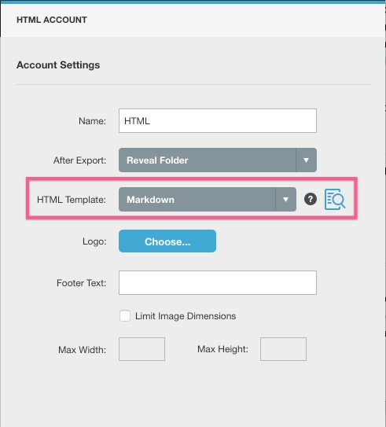
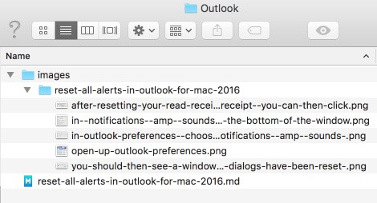

# Clarify To Zendesk


The purpose of this script is to convert the contents of a Clarify document to markdown format, and then upload that to Zendesk as a KB article via the Zendesk API.

The script creates all uploaded KB articles as drafts. You will need to manually set to publish.

This script also uses the requests and markdown python libraries so you will need to install those as well.

## Prepare the script

There are a few global variables you will need to edit in the script:

- ZENDESK_URL = 'https://example.zendesk.com'
- API_USER = 'user@domain.com/token'
- API_PASS = '\<token string from admin interface\>'
- ARTICLE_SECTION = 'Article section in Zendesk to upload to'

## Prepare your Clarify document

- Create a new HTML template in Clarify and set the HTML template to be Markdown


- Create a new folder to put your export in
- Export the document
- You should now have a markdown file and an images directory in the location you made previously


## Run the script

The script accepts two arguments:

	--mdfile MDFILE  Supply markdown input file.
	--title TITLE    The title of the article as you want it to appear in
                   Zendesk

Example run:
```python ClarifyToZendesk.py --mdfile /tmp/outlook/reset-all-alerts-in-outlook-for-mac-2016.md --title "Reset All Alerts in Outlook for Mac 2016"```

At the end you should get a url of the final kb article that you can open in a webbrowser and check the results.
